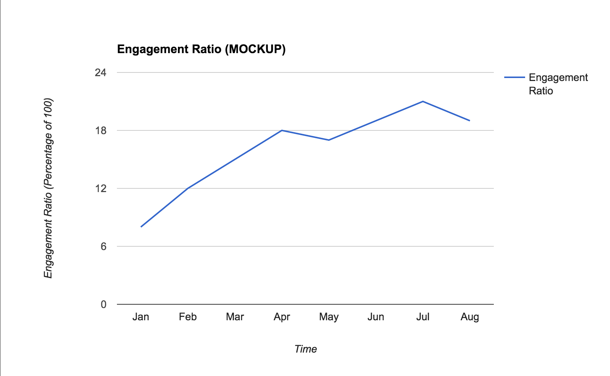

# METRICS

## Data Analysis
The collected data will primarily be used to answer the following questions.
Images are used for visualization and are not composed of actual data.

### Do users install and run this?

What is the overall engagement of the Containers experiment?
**This is the standard Daily Active User (DAU) and Monthly Active User (MAU) analysis.**

This captures data from the users who have the add-on installed, regardless of
whether they are actively interacting with it.



### Immediate Questions

* Do people use the containers feature & how do people create new container tabs?
  * Click to create new container tab
    * \+ `entry-point` value: "tab-bar" or "pop-up"
* Do people who use the containers feature continue to use it?
  * Retention: opening a second container tab (second tab in the same container, or a tab in a second container?)
* What containers do people use?
  * userContextId
    * \+ Number of tabs in the container (when should we measure this? on every tab open?)
* Do people edit their containers?
  * Click on "Edit Containers"
  * Click to edit a single container
    * Click "OK"
  * Click to delete a single container
    * Click "OK"
  * Click to add a container
    * Click "OK"
* Do people sort the tabs?
  * Click sort
    * \+ Number of tabs when clicked
  * Average number of container tabs when sort was clicked
* Do users show and hide container tabs?
  * Click hide
    * \+ Number of tabs when clicked
    * \+ Number of hidden containers when clicked
  * Click show
    * \+ Number of tabs when clicked
    * \+ Number of shown containers when clicked
* Do users move container tabs to new windows?
  * Click move
    * \+ Number of tabs when clicked
  * Average number of container tabs when new window was clicked
* How many containers do users have hidden at the same time? (when should we measure this? each time a container is hidden?)
* Do users pin container tabs? (do we have existing Telemetry for pinning?)
* Do users change URLs in a container tab? (sounds like it could be a flood unless we only record the first URL change?)

### Follow-up Questions

What are some follow-up questions we anticipate we will ask based on any of the
above answers/data?

* What is the average lifespan of a container tab? Is that longer or shorter than a regular tab? (if we don't have data on the latter, the former probably isn't worth gathering data on since we will have nothing to compare it to).

## Data Collection

### Server Side
There is currently no server side component to Containers.

### Client Side
Containers will use Test Pilot Telemetry with no batching of data.  Details
of when pings are sent are below, along with examples of the `payload` portion
of a `testpilottest` telemetry ping for each scenario.

* The user clicks on a container name to open a tab in that container

```js
  {
    "userContextId": <userContextId>,
    "clicked-container-tab-count": <number-of-tabs-in-the-container>,
    "event": "container-tab-opened",
    "eventSource": ["tab-bar"|"pop-up"]
  }
```

* The user clicks "Edit Containers" in the pop-up

```js
  {
    "event": "container-edit-containers"
  }
```

* The user clicks OK after clicking on a container edit icon in the pop-up

```js
  {
    "userContextId": <userContextId>,
    "event": "container-edit-container"
  }
```

* The user clicks OK after clicking on a container delete icon in the pop-up

```js
  {
    "userContextId": <userContextId>,
    "event": "container-delete-container"
  }
```

* The user clicks OK after clicking to add a container in the pop-up

```js
  {
    "userContextId": <userContextId>,
    "event": "container-add-container"
  }
```

* The user clicks the sort button/icon in the pop-up

```js
  {
    "event": "container-sort-tabs",
    "total-container-tabs-count": <number-of-all-container-tabs>
  }
```

* The user clicks "Hide these container tabs" in the popup

```js
  {
    "clicked-container-tab-count": <number-of-tabs-in-the-container>,
    "event": "container-hide-tabs",
    "hidden-containers-count": <number-of-containers-with-tabs-hidden>
  }
```

* The user clicks "Show these container tabs" in the popup

```js
  {
    "clicked-container-tab-count": <number-of-tabs-in-the-container>,
    "event": "container-show-tabs"
  }
```

* The user clicks "Move tabs to a new window" in the popup

```js
  {
    "clicked-container-tab-count": <number-of-tabs-in-the-container>,
    "event": "container-move-tabs-to-window"
  }
```

### A Redshift schema for the payload:

```lua
local schema = {
--   column name                    field type   length  attributes   field name
    {"clickedContainerTabCount",    "INTEGER",   255,    nil,         "Fields[payload.clickedContainerTabCount]"},
    {"userContextId",               "INTEGER",   255,    nil,         "Fields[payload.container]"},
    {"eventSource",                 "VARCHAR",   255,    nil,         "Fields[payload.eventSource]"},
    {"event",                       "VARCHAR",   255,    nil,         "Fields[payload.event]"},
    {"hiddenContainersCount",       "INTEGER",   255,    nil,         "Fields[payload.hiddenContainersCount]"},
    {"totalContainerTabsCount",     "INTEGER",   255,    nil,         "Fields[payload.totalContainerTabsCount]"},
}
```

### Valid data should be enforced on the server side:

All Mozilla data is kept by default for 180 days and in accordance with our
privacy policies.
